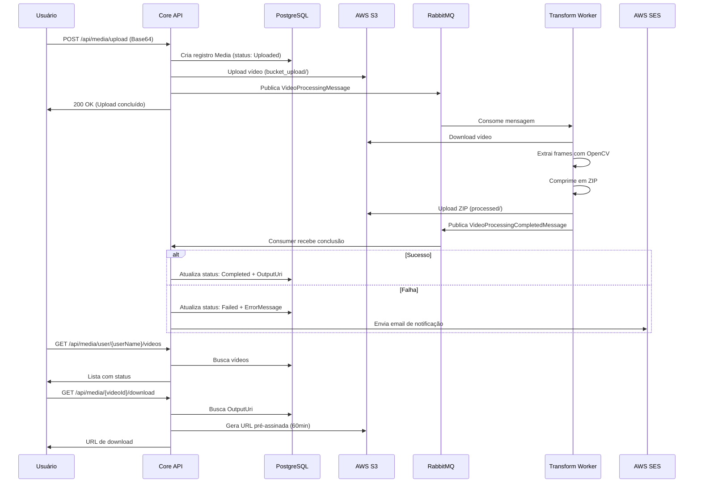

# OptimusFrame.Core

> 🎯 **API principal de gerenciamento de vídeos com processamento assíncrono, integração AWS S3 e RabbitMQ**

[](https://dotnet.microsoft.com/)
[](https://www.postgresql.org/)
[](https://www.rabbitmq.com/)
[](https://aws.amazon.com/s3/)
[](https://blog.cleancoder.com/uncle-bob/2012/08/13/the-clean-architecture.html)

## 📑 Índice

- [Visão Geral](#-visão-geral)
- [Arquitetura](#-arquitetura)
- [Tecnologias Utilizadas](#-tecnologias-utilizadas)
- [Pré-requisitos](#-pré-requisitos)
- [Como Executar](#-como-executar)
- [API Endpoints](#-api-endpoints)
- [Fluxo de Processamento](#-fluxo-de-processamento)
- [Integração com AWS S3](#-integração-com-aws-s3)
- [Integração com RabbitMQ](#-integração-com-rabbitmq)
- [Banco de Dados](#-banco-de-dados)
- [Testes](#-testes)
- [CI/CD](#-cicd)
- [Docker](#-docker)
- [Troubleshooting](#-troubleshooting)

## 🚀 Visão Geral

O **OptimusFrame.Core** é a API principal do sistema OptimusFrame que gerencia o ciclo completo de processamento de vídeos: upload, armazenamento, orquestração do processamento assíncrono, consulta de status e download de resultados.

### Funcionalidades Principais

- **Upload de Vídeos**: Recebe vídeos em formato Base64 e armazena no AWS S3
- **Gerenciamento de Metadados**: Persiste informações no PostgreSQL
- **Processamento Assíncrono**: Orquestra processamento via RabbitMQ
- **Consulta de Status**: Lista vídeos e status de processamento
- **Download de Resultados**: Gera URLs pré-assinadas do S3 para download
- **Notificações**: Envia emails de erro via AWS SES
- **Health Checks**: Kubernetes-ready com probes configuradas

## 🏗️ Arquitetura

O projeto segue rigorosamente a **Clean Architecture** com separação em 4 camadas:

```
OptimusFrame.Core/
├── src/
│   ├── OptimusFrame.Core.API/              # Camada de Apresentação
│   │   ├── Controllers/
│   │   │   └── MediaController.cs          # 3 endpoints REST
│   │   ├── Program.cs                      # Startup e DI
│   │   └── appsettings.json
│   │
│   ├── OptimusFrame.Core.Application/      # Camada de Aplicação
│   │   ├── UseCases/
│   │   │   ├── UploadMedia/               # Upload e publicação
│   │   │   ├── GetUserVideos/             # Listagem
│   │   │   └── DownloadVideo/             # Download
│   │   ├── Interfaces/
│   │   │   ├── IMediaRepository.cs
│   │   │   ├── IMediaService.cs
│   │   │   ├── IVideoEventPublisher.cs
│   │   │   └── INotificationService.cs
│   │   └── DTOs/
│   │
│   ├── OptimusFrame.Core.Domain/           # Camada de Domínio
│   │   ├── Entities/
│   │   │   └── Media.cs                    # Entidade principal
│   │   └── Enums/
│   │       └── MediaStatus.cs              # Status de processamento
│   │
│   └── OptimusFrame.Core.Infrastructure/   # Camada de Infraestrutura
│       ├── Data/
│       │   ├── AppDbContext.cs             # EF Core Context
│       │   └── Migrations/                 # 2 migrations
│       ├── Repositories/
│       │   └── MediaRepository.cs          # Implementação do repo
│       ├── Services/
│       │   ├── MediaService.cs             # AWS S3
│       │   └── NotificationService.cs      # AWS SES
│       └── Messaging/
│           ├── VideoPublisher.cs           # RabbitMQ Producer
│           ├── RabbitMqConnection.cs       # Factory
│           └── Consumers/
│               └── VideoProcessingCompletedConsumer.cs
│
├── tests/
│   └── OptimusFrame.Core.Tests/            # 36+ testes unitários
│
├── docker-compose.yml                       # PostgreSQL + RabbitMQ + API
└── OptimusFrame.Core.sln
```

### Camadas Detalhadas

#### API Layer (Apresentação)
- Endpoints REST para upload, listagem e download
- Health checks integrados (/health, /health/ready, /health/live)
- Configuração de DI e startup

#### Application Layer (Casos de Uso)
- **UploadMediaUseCase**: Orquestra upload para S3 e publicação no RabbitMQ
- **GetUserVideosUseCase**: Retorna vídeos de um usuário
- **DownloadVideoUseCase**: Gera URL pré-assinada de download
- DTOs de Request/Response

#### Domain Layer (Domínio)
- **Media**: Entidade principal com status de processamento
- **MediaStatus**: Enum (Process, Uploaded, Completed, Failed, Error)
- Regras de negócio puras

#### Infrastructure Layer (Infraestrutura)
- EF Core com PostgreSQL
- Repositórios concretos
- Integração AWS S3 (MediaService)
- Integração AWS SES (NotificationService)
- RabbitMQ Producer e Consumer

## 🛠️ Tecnologias Utilizadas

### Backend
- **.NET 8**: Framework principal
- **ASP.NET Core**: Web API framework
- **Entity Framework Core 8**: ORM para PostgreSQL

### Banco de Dados
- **PostgreSQL 16**: Banco de dados relacional
- **Npgsql**: Provider .NET para PostgreSQL

### Mensageria
- **RabbitMQ 3**: Message broker
- **RabbitMQ.Client 6.8.1**: Cliente .NET

### Cloud (AWS)
- **AWS S3**: Armazenamento de vídeos e ZIPs
- **AWS SES**: Serviço de email
- **AWS SDK for .NET**: Integração

### DevOps
- **Docker**: Containerização
- **Docker Compose**: Orquestração local
- **GitHub Actions**: CI/CD pipelines
- **Health Checks**: Para Kubernetes

### Testes
- **xUnit**: Framework de testes
- **Moq**: Biblioteca de mocking
- **FluentAssertions**: Assertions fluentes

## 📋 Pré-requisitos

```bash
.NET 8 SDK
Docker Desktop
PostgreSQL 16 (via Docker)
RabbitMQ 3 (via Docker)
AWS CLI (configurado com credenciais)
Git
```

## 🚀 Como Executar

### Opção 1: Docker Compose (Recomendado)

```bash
# 1. Clonar repositório
git clone https://github.com/Stack-Food/optimus-frame-core.git
cd optimus-frame-core

# 2. Configurar variáveis de ambiente
cat <<EOF > .env
AWS_REGION=us-east-1
AWS_ACCESS_KEY_ID=sua-access-key
AWS_SECRET_ACCESS_KEY=sua-secret-key
RABBITMQ_HOST=rabbitmq
RABBITMQ_PORT=5672
POSTGRES_HOST=postgres
POSTGRES_DB=optimusframe_db
EOF

# 3. Subir todos os serviços
docker-compose up -d

# 4. Verificar status
docker-compose ps

# 5. Ver logs
docker-compose logs -f api
```

**Serviços disponíveis:**
- API: `http://localhost:8082`
- RabbitMQ Management: `http://localhost:15672` (guest/guest)
- PostgreSQL: `localhost:5432` (postgres/postgres)

### Opção 2: Execução Local

```bash
# 1. Subir dependências
docker-compose up postgres rabbitmq -d

# 2. Configurar appsettings.json
# Editar src/OptimusFrame.Core.API/appsettings.json

# 3. Restaurar dependências
dotnet restore

# 4. Aplicar migrations (automático no startup ou manualmente)
cd src/OptimusFrame.Core.Infrastructure
dotnet ef database update

# 5. Executar API
cd ../OptimusFrame.Core.API
dotnet run

# API: http://localhost:5039 (HTTP) ou http://localhost:7189 (HTTPS)
```

## 📡 API Endpoints

### Swagger UI

Acesse a documentação interativa (apenas em Development):
```
http://localhost:8082/swagger
```

### POST /api/media/upload

Faz upload de um vídeo em formato Base64.

**Request:**
```json
{
  "fileName": "video.mp4",
  "userName": "user@example.com",
  "base64": "data:video/mp4;base64,AAAIGZ0dHA..."
}
```

**Response (200 OK):**
```json
{
  "fileName": "video.mp4",
  "sizeInBytes": 5242880,
  "message": "Vídeo video.mp4 processado com sucesso."
}
```

**Erros:**
- `400 Bad Request`: Base64 inválido ou campos vazios
- `500 Internal Server Error`: Erro ao salvar no S3 ou banco

---

### GET /api/media/user/{userName}/videos

Lista todos os vídeos de um usuário com seus status.

**Request:**
```
GET /api/media/user/user@example.com/videos
```

**Response (200 OK):**
```json
[
  {
    "videoId": "123e4567-e89b-12d3-a456-426614174000",
    "fileName": "video1.mp4",
    "status": 3,
    "createdAt": "2024-03-12T10:30:00Z",
    "outputUri": "s3://bucket/processed/123e4567_frames.zip",
    "completedAt": "2024-03-12T10:32:00Z"
  },
  {
    "videoId": "987e6543-e89b-12d3-a456-426614174001",
    "fileName": "video2.mp4",
    "status": 1,
    "createdAt": "2024-03-12T11:00:00Z",
    "outputUri": null,
    "completedAt": null
  }
]
```

**Status Codes:**
- `0` - Process: Em processamento inicial
- `1` - Uploaded: Upload completo, aguardando Worker
- `2` - Error: Erro no processamento (legado)
- `3` - Completed: Processado com sucesso
- `4` - Failed: Falha no processamento

---

### GET /api/media/{videoId}/download

Gera URL pré-assinada do S3 para download do ZIP (válida por 60 minutos).

**Request:**
```
GET /api/media/123e4567-e89b-12d3-a456-426614174000/download
```

**Response (200 OK):**
```json
{
  "url": "https://optimus-bucket.s3.amazonaws.com/processed/123e4567_frames.zip?X-Amz-Algorithm=...",
  "expiresIn": 3600
}
```

**Erros:**
- `404 Not Found`: Vídeo não encontrado
- `400 Bad Request`: Vídeo ainda não foi processado (OutputUri vazio)

---

### GET /health

Health check geral da aplicação (formato JSON).

**Response (200 OK):**
```json
{
  "status": "Healthy",
  "totalDuration": "00:00:00.1234567",
  "entries": {
    "npgsql": {
      "status": "Healthy",
      "duration": "00:00:00.0234567"
    },
    "rabbitmq": {
      "status": "Healthy",
      "duration": "00:00:00.0123456"
    }
  }
}
```

---

### GET /health/ready

Readiness probe para Kubernetes (verifica PostgreSQL e RabbitMQ).

**Response:**
- `200 OK` - Ready
- `503 Service Unavailable` - Not Ready

---

### GET /health/live

Liveness probe para Kubernetes.

**Response:**
- `200 OK` - Alive

## 🔄 Fluxo de Processamento



## ☁️ Integração com AWS S3

### MediaService

**Classe:** `Infrastructure/Services/MediaService.cs`

#### UploadVideoAsync
```csharp
public async Task<string> UploadVideoAsync(
    byte[] fileBytes,
    Guid mediaId,
    string userName,
    string bucketName)
```

**Estrutura de Chaves S3:**
```
bucket_upload/{userName}/{MediaId}_{YYYY-MM-DD}.mp4
```

**Exemplo:**
```
bucket_upload/user@example.com/123e4567_2024-03-12.mp4
```

#### GenerateDownloadUrlAsync
```csharp
public async Task<string> GenerateDownloadUrlAsync(
    string s3Key,
    int expirationMinutes = 60)
```

Gera URL pré-assinada com método `GetPreSignedURL` do AWS SDK.

### Configuração

**appsettings.json:**
```json
{
  "AWS": {
    "Region": "sa-east-1",
    "S3": {
      "BucketName": "optimus-bucket"
    }
  }
}
```

**Program.cs:**
```csharp
builder.Services.AddDefaultAWSOptions(builder.Configuration.GetAWSOptions());
builder.Services.AddAWSService<IAmazonS3>();
builder.Services.AddScoped<IMediaService, MediaService>();
```

## 🐰 Integração com RabbitMQ

### Producer: VideoPublisher

**Publica em:** Exchange `video.processing` → Routing Key `video.processar` → Queue `video.processing.input`

**Mensagem:**
```csharp
public record VideoProcessingMessage
{
    [JsonPropertyName("videoId")]
    public string VideoId { get; init; }

    [JsonPropertyName("fileName")]
    public string? FileName { get; init; }

    [JsonPropertyName("correlationId")]
    public string? CorrelationId { get; init; }
}
```

**Exemplo JSON:**
```json
{
  "videoId": "123e4567-e89b-12d3-a456-426614174000",
  "fileName": "video.mp4",
  "correlationId": "abc-123-def"
}
```

### Consumer: VideoProcessingCompletedConsumer

**Consome de:** Queue `video.processing.completed`

**Mensagem Recebida:**
```csharp
public record VideoProcessingCompletedMessage
{
    [JsonPropertyName("videoId")]
    public string VideoId { get; init; }

    [JsonPropertyName("correlationId")]
    public string? CorrelationId { get; init; }

    [JsonPropertyName("success")]
    public bool Success { get; init; }

    [JsonPropertyName("framesExtracted")]
    public int FramesExtracted { get; init; }

    [JsonPropertyName("outputUri")]
    public string? OutputUri { get; init; }

    [JsonPropertyName("processingTimeSeconds")]
    public double ProcessingTimeSeconds { get; init; }

    [JsonPropertyName("errorMessage")]
    public string? ErrorMessage { get; init; }

    [JsonPropertyName("completedAt")]
    public DateTime CompletedAt { get; init; }
}
```

**Lógica do Consumer:**
```csharp
if (message.Success)
{
    await _mediaRepository.UpdateStatusAsync(
        Guid.Parse(message.VideoId),
        MediaStatus.Completed,
        outputUri: message.OutputUri
    );
}
else
{
    await _mediaRepository.UpdateStatusAsync(
        Guid.Parse(message.VideoId),
        MediaStatus.Failed,
        errorMessage: message.ErrorMessage
    );

    await _notificationService.NotifyProcessingFailureAsync(
        message.VideoId,
        message.ErrorMessage,
        message.CorrelationId
    );
}
```

### Configuração

**appsettings.json:**
```json
{
  "RabbitMQ": {
    "HostName": "localhost",
    "Port": 5672,
    "UserName": "guest",
    "Password": "guest",
    "VirtualHost": "/"
  }
}
```

**Program.cs:**
```csharp
builder.Services.Configure<RabbitMqSettings>(
    builder.Configuration.GetSection("RabbitMQ"));

builder.Services.AddSingleton<RabbitMqConnection>();
builder.Services.AddSingleton<VideoPublisher>();
builder.Services.AddHostedService<VideoProcessingCompletedConsumer>();
```

## 🗄️ Banco de Dados

### Entidade: Media

**Tabela:** `media`

```sql
CREATE TABLE media (
    media_id UUID PRIMARY KEY,
    user_name VARCHAR NOT NULL,
    file_name VARCHAR NOT NULL,
    base64 TEXT,
    url_bucket VARCHAR NOT NULL,
    created_at TIMESTAMP NOT NULL,
    status INTEGER NOT NULL,
    output_uri VARCHAR,
    completed_at TIMESTAMP,
    error_message TEXT
);

CREATE INDEX idx_media_username ON media(user_name);
CREATE INDEX idx_media_status ON media(status);
CREATE INDEX idx_media_created_at ON media(created_at DESC);
```

### Migrations

**Migration 1:** `20260307192006_InitialCreate`
- Cria tabela `media`
- Cria 3 índices

**Migration 2:** `20260312154536_AddOutputUriAndCompletedAtFields`
- Adiciona `OutputUri`
- Adiciona `CompletedAt`
- Adiciona `FileName`
- Adiciona `ErrorMessage`

### Aplicar Migrations

**Automático (no startup):**
```csharp
// Program.cs
using (var scope = app.Services.CreateScope())
{
    var dbContext = scope.ServiceProvider.GetRequiredService<AppDbContext>();
    dbContext.Database.Migrate();
}
```

**Manual:**
```bash
cd src/OptimusFrame.Core.Infrastructure
dotnet ef database update

# Criar nova migration
dotnet ef migrations add NomeDaMigration
```

**Documentação completa:** [DATABASE-SETUP.md](DATABASE-SETUP.md)

## 🧪 Testes

### Estrutura de Testes

```
tests/OptimusFrame.Core.Tests/
├── Repositories/
│   └── MediaRepositoryTests.cs          (11 testes)
├── UseCases/
│   ├── UploadMediaUseCaseTests.cs       (7 testes)
│   ├── GetUserVideosUseCaseTests.cs     (3 testes)
│   └── DownloadVideoUseCaseTests.cs     (4 testes)
└── Services/
    └── NotificationServiceTests.cs      (11 testes)
```

**Total: 36+ testes unitários**

### Executar Testes

```bash
# Todos os testes
dotnet test

# Com detalhes
dotnet test --verbosity normal

# Com cobertura
dotnet test --collect:"XPlat Code Coverage"

# Gerar relatório de cobertura
dotnet tool install -g dotnet-reportgenerator-globaltool
reportgenerator \
  -reports:TestResults/**/coverage.cobertura.xml \
  -targetdir:coverage \
  -reporttypes:Html

# Abrir relatório
open coverage/index.html
```

### Cobertura

**Meta:** 70%+ de code coverage

**Áreas cobertas:**
- ✅ Repositórios (100%)
- ✅ Use Cases (95%)
- ✅ Serviços (90%)
- ⚠️ Controllers (parcial - testes de integração futuros)

## 🚀 CI/CD

### GitHub Actions

**Workflows:**

1. **Build and Test** (`.github/workflows/build.yml`)
   - Restaura dependências
   - Compila em Release mode
   - Executa testes unitários
   - Gera relatórios de cobertura

2. **Docker Build** (`.github/workflows/docker.yml`)
   - Constrói imagem Docker
   - Utiliza cache do GitHub Actions
   - Tags: `prod-optimusframe-core:${SHA}` ou `dev-optimusframe-core:${SHA}`

3. **Docker Push** (`.github/workflows/docker-push.yml`)
   - Publica no GitHub Container Registry (GHCR)
   - Assina com Cosign
   - Apenas em push para main/develop (não em PRs)

4. **Deploy** (`.github/workflows/deploy.yml`)
   - Workflow manual (workflow_dispatch)
   - Atualiza deployment no EKS
   - Aguarda rollout (timeout: 5min)

5. **SonarQube Analysis** (`.github/workflows/sonar.yml`)
   - Análise estática de código
   - Métricas de qualidade
   - Detecção de code smells

### Secrets Necessários

| Secret                   | Descrição                          |
|--------------------------|------------------------------------|
| `AWS_ACCESS_KEY_ID`      | ID da chave AWS                    |
| `AWS_SECRET_ACCESS_KEY`  | Chave secreta AWS                  |
| `AWS_REGION`             | Região AWS (ex: us-east-1)         |
| `EKS_CLUSTER_NAME`       | Nome do cluster EKS                |
| `SONAR_TOKEN`            | Token do SonarCloud                |
| `GITHUB_TOKEN`           | Fornecido automaticamente          |

## 🐳 Docker

### Dockerfile

**Multi-stage build:**

```dockerfile
# Stage 1: Build
FROM mcr.microsoft.com/dotnet/sdk:8.0 AS build
WORKDIR /app
COPY . .
RUN dotnet restore
RUN dotnet publish -c Release -o /app/publish

# Stage 2: Runtime
FROM mcr.microsoft.com/dotnet/aspnet:8.0 AS runtime
WORKDIR /app
COPY --from=build /app/publish .
EXPOSE 8080
ENTRYPOINT ["dotnet", "OptimusFrame.Core.API.dll"]
```

### Docker Compose

**Serviços:**

```yaml
services:
  postgres:
    image: postgres:16-alpine
    container_name: optimus-frame-postgres
    ports:
      - "5432:5432"
    environment:
      POSTGRES_DB: optimusframe_db
      POSTGRES_USER: postgres
      POSTGRES_PASSWORD: postgres
    healthcheck:
      test: ["CMD-SHELL", "pg_isready -U postgres"]
      interval: 10s
      timeout: 5s
      retries: 5

  rabbitmq:
    image: rabbitmq:3-management
    container_name: optimus-rabbitmq
    ports:
      - "5672:5672"
      - "15672:15672"
    healthcheck:
      test: rabbitmq-diagnostics ping
      interval: 10s
      timeout: 5s
      retries: 5

  api:
    build:
      context: .
      dockerfile: Dockerfile
    container_name: optimus-frame-api
    ports:
      - "8082:8080"
    depends_on:
      postgres:
        condition: service_healthy
      rabbitmq:
        condition: service_healthy
    environment:
      ConnectionStrings__DefaultConnection: "Host=postgres;Database=optimusframe_db;Username=postgres;Password=postgres"
      RabbitMQ__HostName: rabbitmq
```

**Comandos:**

```bash
# Subir todos os serviços
docker-compose up -d

# Ver logs
docker-compose logs -f

# Parar serviços
docker-compose down

# Limpar volumes
docker-compose down -v
```

## 🔧 Troubleshooting

### Erro de Conexão com PostgreSQL

**Sintoma:**
```
Npgsql.NpgsqlException: Failed to connect to [::1]:5432
```

**Solução:**
```bash
# Verificar se PostgreSQL está rodando
docker ps | grep postgres

# Ver logs
docker logs optimus-frame-postgres

# Testar conexão
docker exec -it optimus-frame-postgres psql -U postgres -d optimusframe_db
```

---

### Erro de Conexão com RabbitMQ

**Sintoma:**
```
RabbitMQ.Client.Exceptions.BrokerUnreachableException
```

**Solução:**
```bash
# Verificar se RabbitMQ está rodando
docker ps | grep rabbitmq

# Acessar Management UI
http://localhost:15672 (guest/guest)

# Testar conectividade
telnet localhost 5672
```

---

### Migrations não aplicadas

**Sintoma:**
```
Npgsql.PostgresException: 42P01: relation "media" does not exist
```

**Solução:**
```bash
# Aplicar migrations manualmente
cd src/OptimusFrame.Core.Infrastructure
dotnet ef database update

# Verificar migrations aplicadas
dotnet ef migrations list
```

---

### Erro ao fazer Upload para S3

**Sintoma:**
```
Amazon.S3.AmazonS3Exception: Access Denied
```

**Solução:**
```bash
# Verificar credenciais AWS
aws sts get-caller-identity

# Testar acesso ao bucket
aws s3 ls s3://optimus-bucket/

# Verificar permissões IAM
# Política necessária: s3:PutObject, s3:GetObject
```

---

### Consumer não recebe mensagens

**Sintoma:**
Mensagens publicadas no RabbitMQ mas consumer não processa

**Solução:**
```bash
# Verificar se consumer está rodando
docker logs optimus-frame-api | grep Consumer

# Verificar filas no RabbitMQ Management
http://localhost:15672/#/queues

# Verificar bindings
# Exchange: video.processing
# Queue: video.processing.input
# Routing Key: video.processar
```

## 📚 Documentação Adicional

- [📖 README Principal do Projeto](../README.md)
- [🗄️ Database Setup Guide](DATABASE-SETUP.md)
- [📋 Sprint Planning](../SPRINT-PLANNING.md)

## 🤝 Contribuindo

1. Fork o projeto
2. Crie uma branch (`git checkout -b feature/nova-feature`)
3. Commit suas mudanças (`git commit -m 'Adiciona nova feature'`)
4. Push para a branch (`git push origin feature/nova-feature`)
5. Abra um Pull Request

### Guidelines

- Siga Clean Architecture
- Escreva testes unitários (cobertura > 70%)
- Use conventional commits
- Documente APIs com XML comments
- Atualize README quando necessário

## 📄 Licença

Este projeto está sob a licença MIT.

## 👥 Contato

Stack Food Team - team@stackfood.com

**Links do Projeto:**
- [GitHub - OptimusFrame Core](https://github.com/Stack-Food/optimus-frame-core)
- [GitHub - OptimusFrame](https://github.com/Stack-Food/optimus-frame)

## 🔗 Referências

- [.NET 8 Documentation](https://docs.microsoft.com/dotnet/)
- [Entity Framework Core](https://docs.microsoft.com/ef/core/)
- [RabbitMQ .NET Client](https://www.rabbitmq.com/dotnet-api-guide.html)
- [AWS SDK for .NET](https://aws.amazon.com/sdk-for-net/)
- [PostgreSQL Documentation](https://www.postgresql.org/docs/)
- [Clean Architecture](https://blog.cleancoder.com/uncle-bob/2012/08/13/the-clean-architecture.html)

---

<p align="center">
  <strong>OptimusFrame.Core</strong> - Gerenciamento inteligente de vídeos 🎯
</p>

<p align="center">
  Desenvolvido com ❤️ pela equipe Stack Food
</p>
